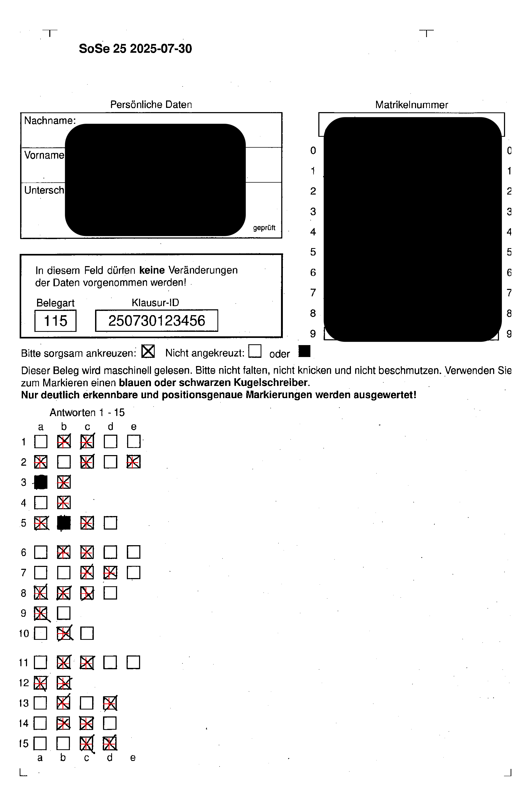

# Fork of the r-exams R package

See https://www.r-exams.org/.
The original package is hosted at https://R-Forge.R-project.org/R/?group_id=1337.

Install it with:

```r
devtools::install_github("nicebread/exams")
```

This fork adds some functionality:

### Visual inspection of the scanned and evaluated exams

In the `nops_scan()` function, you can add the `saveInspection = TRUE` argument.
Then for each evaluated exam, a copy is saved in the `/check` subfolder (relative to the original file location) which contains the exam with the detected answers as red crosses. This allows a fast visual inspection whether the scan was correct. In this example, all check marks have been correctly detected (and the two black squares correctly identified as "not checked").



Full code example:

```r
nops_scan(
    images = dir(pattern = "\\.PNG$|\\.png$",
                 path = "Statistik MSc/2025 SS/nops_scan/", 
                 full.names = TRUE),
    dir = "Statistik MSc/2025 SS/nops_scan/",
    rotate = FALSE, saveInspection = TRUE
  )
```